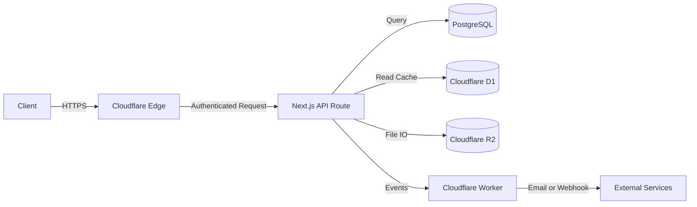

# Architecture: Fund Management Platform

> [!NOTE]
> This file documents the high level system architecture. Update it whenever a structural decision changes.

## Overview

The Fund Management platform is a multi tenant SaaS built on a modern, edge first stack. It manages fund portfolios, investor capital, NAV calculations, and regulatory reporting for asset managers.

---

## System Layers

```
┌─────────────────────────────────────────────────────┐
│                  CLIENT (Browser)                   │
│  Next.js 14 App Router · React · TailwindCSS        │
├─────────────────────────────────────────────────────┤
│               EDGE / CDN LAYER                      │
│  Cloudflare Pages · Edge Middleware · WAF           │
├─────────────────────────────────────────────────────┤
│               API / COMPUTE LAYER                   │
│  Next.js API Routes · Cloudflare Workers            │
├─────────────────────────────────────────────────────┤
│               DATA LAYER                            │
│  PostgreSQL (primary) · Cloudflare D1 (edge reads)  │
│  Cloudflare R2 (document storage)                   │
├─────────────────────────────────────────────────────┤
│               AUTH & IDENTITY                       │
│  Clerk · Role Based Access Control (RBAC)           │
├─────────────────────────────────────────────────────┤
│               OBSERVABILITY                         │
│  Sentry · Cloudflare Analytics                      │
└─────────────────────────────────────────────────────┘
```

---

## Module Boundaries

| Module | Responsibility | Owner Layer |
|--------|---------------|-------------|
| `auth` | Authentication, RBAC, session management | Edge + DB |
| `funds` | Fund CRUD, NAV calculation, share class management | API + DB |
| `investors` | Investor profiles, capital accounts, KYC | API + DB |
| `transactions` | Subscriptions, redemptions, transfers | API + DB |
| `reporting` | Statement generation, regulatory exports | API + R2 |
| `documents` | Upload, storage, versioning | R2 + API |
| `notifications` | Email, in app, webhook events | Workers |
| `admin` | Platform configuration, tenant management | API + DB |

---

## Data Flow



---

## Deployment Topology

- **Frontend**: Cloudflare Pages (SSR via Next.js adapter)
- **Backend APIs**: Next.js API Routes, plus Cloudflare Workers for async jobs
- **Database**: Managed PostgreSQL (Neon or Supabase)
- **Storage**: Cloudflare R2 for documents and reports
- **Cache**: Cloudflare D1, plus Next.js `unstable_cache`
- **Auth**: Clerk (JWT based, edge compatible)

---

## Key Architectural Decisions

| Decision | Choice | Rationale |
|----------|--------|-----------|
| Rendering | App Router (RSC) | Reduces client JS and improves TTFB |
| Auth | Clerk | Multi tenant RBAC out of the box |
| Storage | R2 | No egress fees, S3 compatible |
| Edge DB | D1 | Low latency reads at the edge |
| Styling | Tailwind + shadcn/ui | Design system consistency |

---

## Security Boundaries

- All API routes require a valid JWT via Clerk
- RBAC enforced at the middleware level on Cloudflare Edge
- Fund data stays tenant isolated through `orgId` on every database query
- Document URLs are signed with 1 hour expiry via R2 presigned URLs
- PII fields encrypted at rest using AES-256

---

*Last updated: 2026-10-01*
